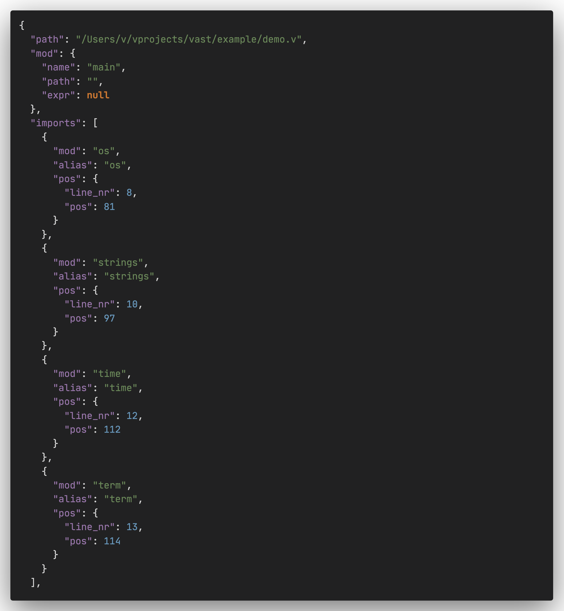
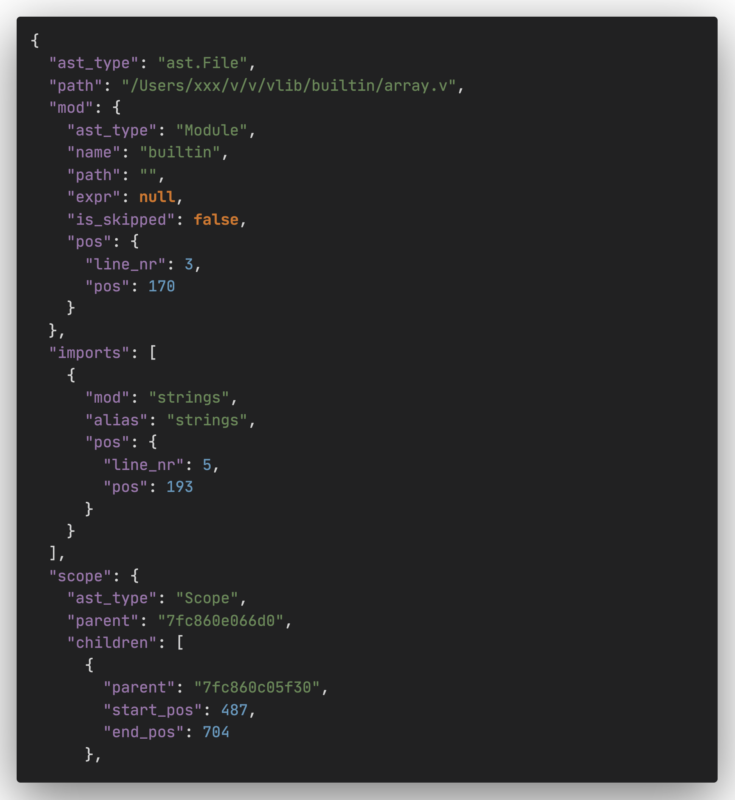
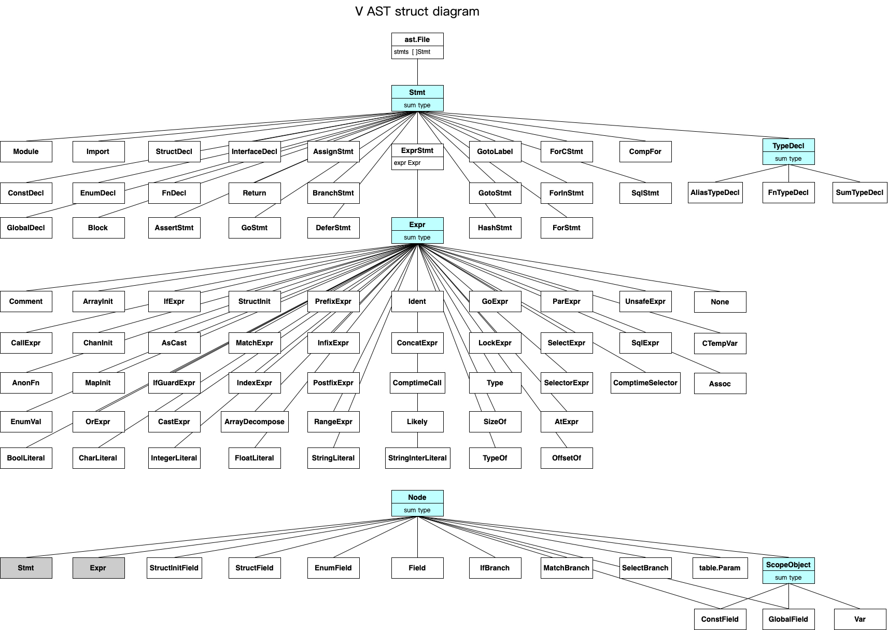

## vast

A simple tool for vlang, generate v source file to  AST json file.

so you can see the AST of v source file.

**NOTE:**

**vast will follow the newest version of V. If you run into an error, please update your version of V by running `v up`.**

## Installation

- via vpm

```shell
v install lydiandy.vast
```

- via source

```shell
git clone git@github.com:lydiandy/vast.git
ln -s `pwd`/vast ~/.vmodules/vast
```

## build

```shell
cd vast
v -prod .
```

## usage

```
vast demo.v 	 //generate demo.json file and exit.

vast -w demo.v 	 //generate demo.json and watch,if demo.v file change,regenerate.

vast -p demo.v 	 //no generate json file,just print the json string to termial.
```


```shell
./vast ./example/demo.v
```

 it will parse the demo.v file and generate demo.json, open it ~



or you can parse the vlib/builtin/array.v

```shell
vast your/v/dir/vlib/builtin/array.v 
```

it will generate array.json file, ~22000 lines json code.



## AST struct diagram



## todo


## License

MIT

## Contributors

pull request is welcome ~
